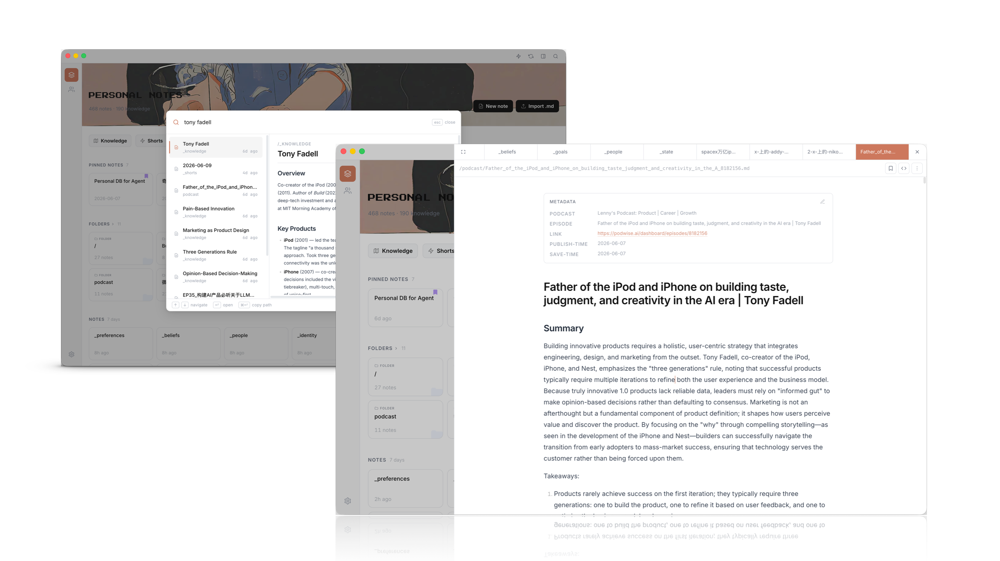
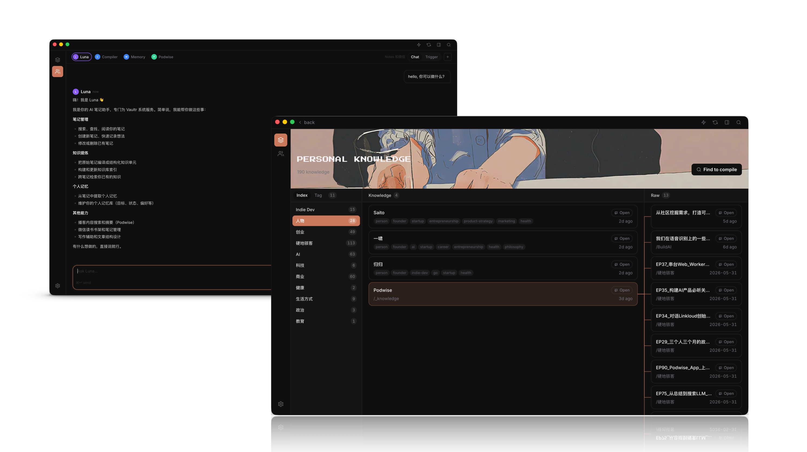
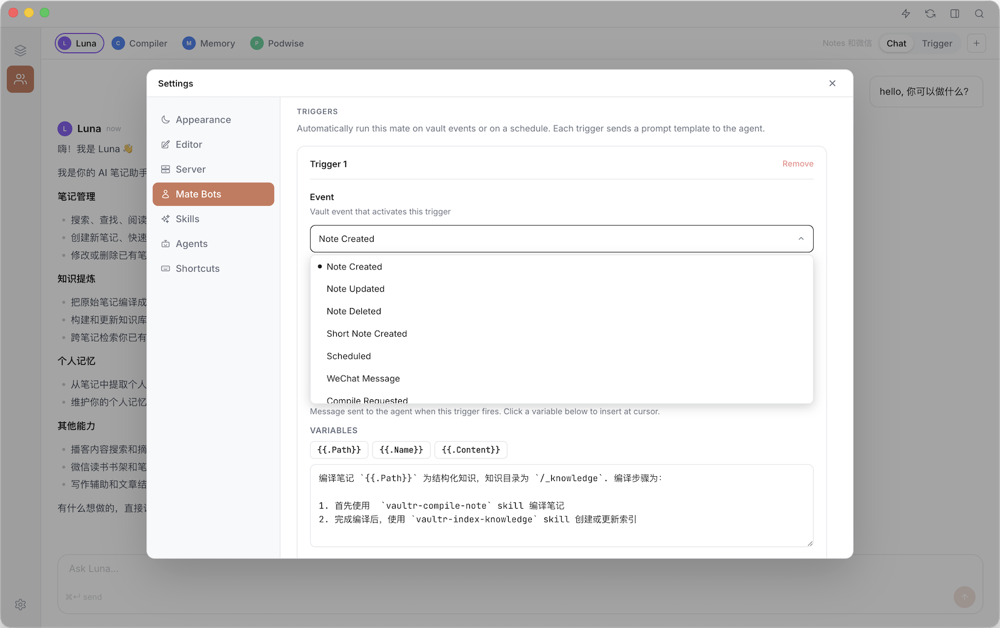
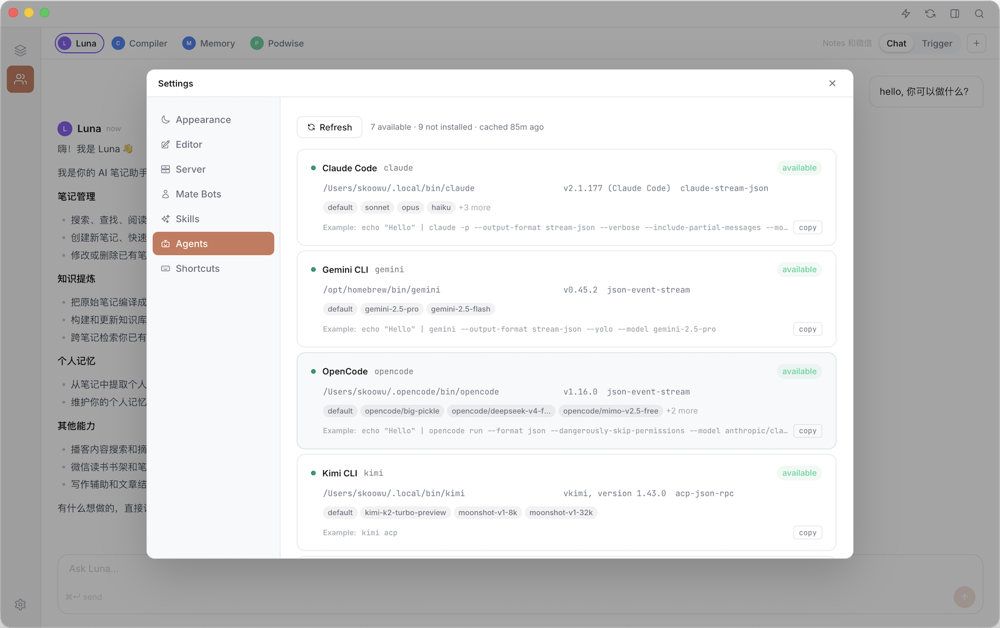
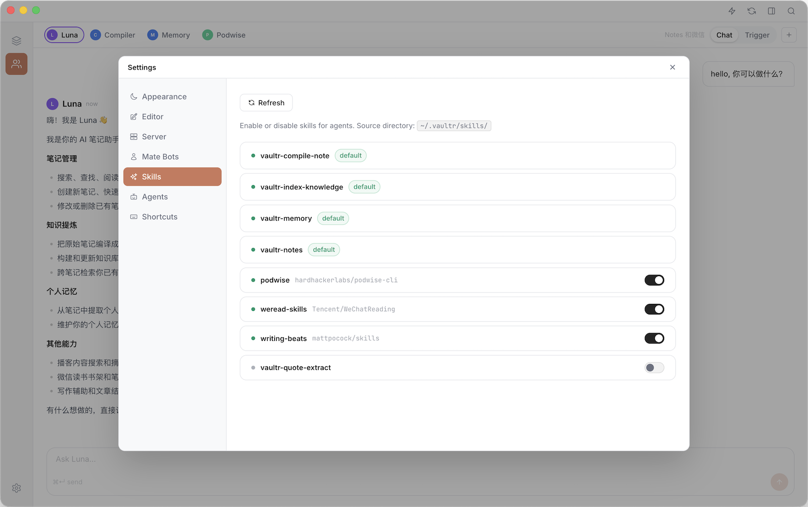

# Vaultr：AI-native 笔记系统




## 目录

- [它能做什么](#它能做什么)
- [设计](#设计)
- [架构](#架构)
- [安装](#安装)
- [从 Obsidian 迁移](#从-obsidian-迁移)
- [编辑器](#编辑器)
- [Shorts 速记流](#shorts-速记流)
- [Mate Bots](#mate-bots)
- [微信](#微信)
- [笔记 AI 编译器](#笔记-ai-编译器)
- [个人记忆（Memory）](#个人记忆memory)
- [Skills](#skills)
- [自定义 AI 行为](#自定义-ai-行为)
- [CLI 用法](#cli-用法)
- [快捷键](#快捷键)

## 它能做什么

#### 📝 完整的笔记软件
- **内置 WYSIWYG 编辑器**——富文本和原始 Markdown 随时切换
- **Wikilinks 和 Wiki 图片**——完全兼容 Obsidian
- **Shorts 速记流**——随手记的日常捕捉流，随时打开
- **即时搜索**，Raycast 那种体验
- **Clip 浏览器扩展**，一键把网页存成 Markdown
- 支持自部署到远程服务器

#### 🤖 事件驱动的多 Agent 系统
- **集成了 16 个 agent**，直接复用你本地的 Agent
- **事件触发自动化**，笔记一创建、消息一来，agent 自动跑起来
- **微信直连**，直接在微信聊天框里和 agent 对话

#### 🧠 笔记 AI 编译器
- 把你的笔记自动编译成**结构化知识点**

#### 🪞 个人记忆（Memory）
- 从你的笔记中自动生成**个人记忆**——身份、偏好、目标、信念、人际关系、当前状态，写进结构化文件，随时间持续更新
- 让 agent 真正**记住你、认识你**，每次对话都有记忆，不再是陌生人

#### 🔒 本地优先，完全离线
- 所有数据存在你自己的机器上——Markdown 文件、SQLite 元数据、全文索引，一个不漏
- 桌面 App 内置所有依赖，无需 CDN、无需账号、断网也能用

#### 🌐 多端都能用
- **CLI**、**桌面 App**、**微信**，随便选

## 设计

Vaultr 的核心主张只有一句话：**让 AI 帮你整理笔记，而不是你自己整理。**

#### 随便写，不要管理

Vaultr 不鼓励你把精力花在维护笔记上——精心分类、建目录体系、打标签、整理归档，这些都是低价值的重复劳动。记笔记应该是顺手的、随心的，想写就写。

具体来说，Vaultr **只支持单层目录**。你可以建 `/读书`、`/工作`、`/想法` 这样的简单分类，但不能在里面再嵌套子目录。这不是功能缺失，是刻意设计——把你从"这条笔记该放哪"的心智负担中解放出来。

#### AI 编译，而非人工整理

笔记写完之后怎么变成有用的知识？Vaultr 的答案是交给 AI：

- 你写速记、写随笔、存网页——这些是原始输入，不需要整理
- AI agent 自动把这些笔记**编译成结构化知识点**，存入知识库
- 知识库再进一步提炼成**个人记忆**，让每次对话都有上下文

整个过程全自动，你不需要参与任何整理工作。

#### 检索也交给 AI

Vaultr 提供全文搜索，但更重要的是让 agent 替你检索。当你需要某个信息时，直接问 agent，它会自动在笔记和知识库里找到答案——不需要你自己翻。

#### ⚠️ 使用 Vaultr，你必须知道的那些事

- **不支持嵌套目录树**。Vaultr 推荐单层扁平目录结构，不要在分类目录下再建子目录 (虽然你可以这么做)。
- **文件名最好唯一**。Vaultr 用 Wiki Link `[[stem]]` 格式引用笔记，链接的是文件名而非路径，文件名重复会导致引用歧义。
- **下划线前缀是系统目录**。`_knowledge/`、`_shorts/`、`_memory/` 这类以 `_` 开头的目录是 Vaultr 内部使用的，你自己的分类目录不要用下划线前缀。
- **Vaultr 本身不内置 AI Agent**。需要你的电脑上已安装 agent 环境（如 Claude Code、OpenCode、Codex 等）。Vaultr 会自动从 PATH 中发现它们，无需额外配置。查看[支持的底层 Agent](#底层-agent)。

## 架构

```
┌──────────────┐  ┌──────────────┐  ┌──────────────┐  ┌──────────────┐
│              │  │              │  │              │  │              │
│  Desktop App │  │    WeChat    │  │     CLI      │  │  Clip (Ext)  │
│              │  │              │  │              │  │              │
└──────┬───────┘  └──────┬───────┘  └──────┬───────┘  └──────┬───────┘
       │                 │                 │                 │
       └─────────────────┴─────────────────┴─────────────────┘
                                  │
                                  ▼
┌────────────────────────────────────────────────────────────────────┐
│                           Vaultr Server                            │
└──────┬─────────────────┬─────────────────┬─────────────────┬───────┘
       │                 │                 │                 │
       ▼                 ▼                 ▼                 ▼
┌──────────────┐  ┌──────────────┐  ┌──────────────┐  ┌──────────────┐
│  Filesystem  │  │    SQLite    │  │    Bleve     │  │    Agents    │
│   (Markdown) │  │  (Metadata)  │  │  (FTS Index) │  │  (CLI/MCP)   │
└──────────────┘  └──────────────┘  └──────────────┘  └──────────────┘
```

**Vaultr Server** 是一个独立的 Go 二进制程序——没有依赖。SQLite 和 Bleve 都直接内嵌其中，整个服务端就是一个可执行文件，放哪里跑哪里。

它本质上是一个普通的 HTTP 服务，可以跑在本地，也可以部署到远程云服务器或容器里。所有客户端（桌面 App、CLI、微信桥接）通过网络连接，方式完全一样。

## 安装

> **大多数用户只需要安装桌面 App 和 Clip 扩展**。桌面 App 首次启动时会自动检测 CLI，未安装时提供一键安装。仅当你需要在远程主机上独立部署 Server 时，才需要单独执行安装命令。

#### 💻 桌面 App

1. 去 [最新发布页](https://github.com/skoowoo/vaultr-notes/releases/latest) 下载 `.dmg`
2. 打开 dmg，把 Vaultr 拖进应用程序文件夹
3. 第一次启动 macOS 可能拦截（签名了但没公证）

   解决也很简单：**系统设置 → 隐私与安全性**，找到拦截提示点**仍要打开**就好

#### 🧩 浏览器扩展（Clip）

1. 同样去 [最新发布页](https://github.com/skoowoo/vaultr-notes/releases/latest) 下载 `vaultr-clip-*.zip`
2. 解压
3. 打开 Chrome/Edge，地址栏输 `chrome://extensions/`
4. 右上角打开**开发者模式**
5. 点**加载已解压的扩展程序**，选解压后的文件夹
6. 装好了，工具栏里能看到图标

#### ⌨️ Server 与 CLI

一行命令搞定：

```sh
curl -sL https://raw.githubusercontent.com/skoowoo/vaultr-notes/main/install-cli.sh | sh
```

## 从 Obsidian 迁移

> Vaultr 和 Obsidian 可以共存，无需二选一。如果你习惯用 Obsidian 写笔记，完全可以只把 Vaultr 当做跑在同一个 vault 上的 AI Agent 自动化层——Vaultr 生成和修改的所有笔记都是兼容 Obsidian 的，在 Obsidian 里打开没有任何异样。

把 `vaultr init` 指向你的 vault 目录就行：

```sh
# 在当前目录初始化
vaultr init

# 或者指定路径
vaultr init /path/to/your/obsidian-vault
```

跑完之后，Vaultr 会在目录里创建 `.vaultr/` 文件夹、扫描所有 Markdown 文件、建好全文搜索索引。如果 `.vaultr/` 已经存在，命令什么都不会动，放心跑。

然后打开 **Vaultr App** 完成最后一步：

1. **Settings → Server → Config**
2. **Vault** 那里选你的 vault 目录
3. 保存

笔记就出现了。

## 编辑器

Vaultr 内置 WYSIWYG Markdown 编辑器，打开笔记默认进入富文本模式，随时可以切换为原始 Markdown。

#### ✍️ 写作

编辑器支持完整的 CommonMark 和 GFM 语法：标题、加粗、斜体、删除线、行内代码、代码块、表格、任务列表。YAML frontmatter 原样保留，不会被修改。

#### 🔗 Wikilinks 与 Wiki 图片

输入 `[[` 插入 wikilink，别名写法与 Obsidian 一致：`[[页面名|别名]]`。图片用 `![[文件名.png]]` 嵌入。

#### 查找与替换

在编辑器内按 `⌘F`（`Ctrl+F`）打开查找/替换面板。若当前处于 WYSIWYG 模式，会自动切换到 Source 模式后打开面板。点击 **Aa** 按钮可切换大小写敏感。用 Enter / Shift+Enter 在匹配项间跳转，支持单个替换或全部替换。按 `Escape` 关闭。

#### 选中工具条

在 WYSIWYG 模式下选中文字后，浮动工具条会出现在选区上方：

- **行内格式切换** — 加粗、斜体、删除线、行内代码
- **块级格式切换** — H1–H4、引用块、无序列表、有序列表（选区跨块级内容时显示）
- **字数统计** — 显示当前选区的字数
- **复制 Markdown** — 把选区的原始 Markdown 复制到剪贴板
- **⚡ 存为 Short** — 把选区追加到今天的 Short Notes，并自动附上 `[[来源笔记]]` 反向链接
- **关闭** — 收起选区并隐藏工具条

## Shorts 速记流

Shorts 是一个轻量的日常捕捉流——按天存储的速记条目，保存在 vault 的 `/_shorts/` 目录下，每天一个 Markdown 文件。

#### ⚡ 记录

| 方式         | 操作                               |
| ------------ | ---------------------------------- |
| 快速记录弹窗 | 在 App 任意位置按 `⌘.`（`Ctrl+.`） |
| 从编辑器存入 | 选中任意段落 → 点工具条中的 **⚡**  |

从编辑器存入时，Vaultr 会自动在条目末尾附上 `[[来源笔记]]` 反向链接，方便日后追溯。

#### 📅 查看

- **Stream 流** — 按日期分组的时间线，今天的条目显示在最上方，向下滚动加载更早的记录
- **Calendar 日历** — 月视图，标记哪些日期有记录，点击任意日期跳转到当天的条目

## Mate Bots

Mate Bot 就是你在 **Settings → Mate Bots** 里养的私人 AI。每个 mate 有自己的名字、系统 prompt，以及背后驱动它的 agent。

#### 🔔 事件触发器

Mate 最有意思的地方是事件驱动——配好触发器，你什么都不用管，它自己跑。内置的事件有这些：

| 事件                 | 什么时候触发                 |
| -------------------- | ---------------------------- |
| `note_created`       | vault 里新建了笔记           |
| `note_updated`       | 有笔记被改了                 |
| `note_deleted`       | 有笔记被删了                 |
| `short_note_created` | 加了一条速记                 |
| `scheduled`          | 按你设定的时间或间隔定时触发 |
| `wechat_message`     | 收到微信私信                 |
| `compile_requested`  | 手动触发了笔记编译           |



#### 底层 Agent

> **Vaultr 直接从本地 `PATH` 发现可用的 agent CLI，不用任何额外配置。** 你已经在用 Claude Code 写代码？用 Gemini CLI 做研究？在终端里跑 Copilot？Vaultr 启动时自动找到它们，直接拿来用。你的工具，你的习惯，Vaultr 不折腾你。

开箱集成 **16 个 agent CLI**：

- Claude Code
- OpenCode
- Codex CLI
- Gemini CLI
- Cursor Agent
- Hermes
- GitHub Copilot CLI
- Pi
- DeepSeek TUI
- Kimi CLI
- Mistral Vibe CLI
- Devin for Terminal
- Qwen Code
- Qoder CLI
- Kiro CLI
- Kilo



## 微信

想在微信里和 agent 聊？配两步就行。

#### 第一步：连上微信

1. **Settings → Server → Config → WeChat**
2. 点 **Scan QR to log in**，扫码
3. 手机微信确认登录
4. 状态变成 **Connected** 后点 **Save all**

搞定，微信桥接服务开始监听新消息。

#### 第二步：创建一个 `wechat_message` 触发的 Mate Bot

1. **Settings → Mate Bots** → **New Mate**
2. 起个名字，选 agent 和模型
3. **Triggers** 下点 **+ Add trigger**
4. **Event** 选 `wechat_message`
5. Prompt 模板写：

   ```
   {{.Content}}
   ```

6. 保存

之后每条微信私信都会触发这个 mate，自动帮你回复。

## 笔记 AI 编译器

让 AI 自动把你的笔记编译成结构化知识点，不用自己整理。

#### 第一步：打开编译器

**Settings → Server → Config → Compile** 开启，默认就是开的。

#### 第二步：创建一个带编译触发器的 Mate

在 **Settings → Mate Bots** 里新建 mate，触发方式有两种，按需选：

1. 新笔记进来自动编译（`note_created` + Path Prefix）

**Event** 选 `note_created`，填上 **Path Prefixes**（比如 `/Web Clips/`）。以后这个目录里一有新笔记，mate 就自动跑。

示例 prompt：
```
使用 compile skill 编译笔记 `{{.Path}}` ，编译完成后使用 index skill 更新知识索引。
```

2. 手动触发（`compile_requested`）

**Event** 选 `compile_requested`。你在 app 里手动发起编译时触发，更灵活。

示例 prompt：
```
使用 compile skill 编译笔记 `{{.Path}}` ，编译完成后使用 index skill 更新知识索引。
```

## 个人记忆（Memory）

Vaultr 能从你的笔记里提取个人记忆，生成六个结构化文件（身份、偏好、目标、信念、人际关系、当前状态），存在 `/_memory/` 下。用 AI 帮你"认识自己"，听起来有点玄，但挺实用的。

默认只扫**速记**（`/_shorts`）和**知识库**（`/_knowledge`）。如果你想多扫几个目录，在 prompt 里说一句就行。

#### 💬 方式一：直接在 Chat 里让 agent 跑

对着任意 agent 说一句话就能触发：

```
请更新我的 memory。我是 XXX，目前在做 YYY 项目，…（简单自我介绍）
```

Agent 会自己调用 `vaultr-memory` skill 完成提取。首次运行扫最近 90 天，之后每次增量只扫最近 2 天，很快。

#### ⏰ 方式二：定时 Mate，每天自动更新

懒人方案。在 **Settings → Mate Bots** 里建一个定时 Mate，让它每天自己跑。

1. **Settings → Mate Bots** → **New Mate**
2. 名字随便起，比如 `Daily Memory`，选好 agent 和模型
3. **Triggers** → **+ Add trigger**
4. **Event** 选 `scheduled`，设好每天的执行时间（比如每天 08:00）
5. Prompt 写上你的自我介绍：

   ```
   请更新我的个人记忆。我是 XXX，目前在做 YYY 项目。
   ```

   想多扫几个目录就加一句：

   ```
   请更新我的个人记忆。我是 XXX，目前在做 YYY 项目。另外请扫描 /journal/ 目录。
   ```

6. 保存

之后每天定时自动跑，你什么都不用管。

## Skills

Vaultr 内置了一套 skill，agent 执行任务时会自动调用。你也可以把自己写的 skill 扔进 `~/.vaultr/skills/` 来扩展。

每个 skill 就是一个带 `SKILL.md` 的目录：

```
~/.vaultr/skills/
└── your-skill/
    └── SKILL.md
```

安装自定义 skill：

```sh
cp -r your-skill ~/.vaultr/skills/
```

Vaultr 启动时会自动加载 `~/.vaultr/skills/` 下的所有 skill。



## 自定义 AI 行为

Vaultr 的每一层 AI 输出都可以自定义：

#### 1. 全局 Agent System Prompt

**设置 → Server → Config → Agent** — 填写 `agent.system_prompt` 替换内置的全局 system prompt，该 prompt 会拼接在每次 agent 运行的最前面。留空时 Vaultr 使用内置默认值，该默认值会告知 agent vault 的目录结构、wiki-link 语法以及个人记忆文件的位置。

#### 2. 每个 Mate 的 System Prompt 与 Trigger Prompt

在**设置 → Mate Bots** 中，每个 Mate 有两个自定义点：

- **System Prompt** — Mate 专属指令，附加在全局 system prompt 之后（用 `---` 分隔）。
- **Trigger Prompt 模板** — Trigger 触发时发送给 agent 的用户消息，支持变量：vault 事件用 `{{.Path}}`、`{{.Name}}`、`{{.Content}}`；定时触发用 `{{.Now}}`、`{{.Date}}`、`{{.Time}}`；微信消息用 `{{.Content}}`、`{{.WechatUserID}}`。

#### 3. 重写知识编译 Skill

知识编译行为由 `~/.vaultr/skills/vaultr-compile-note/SKILL.md` 定义。编辑此文件即可改变原始笔记被编译成结构化知识单元的方式。

#### 4. 重写记忆抽取 Skill

个人记忆抽取行为由 `~/.vaultr/skills/vaultr-memory/SKILL.md` 定义。编辑此文件即可改变抽取内容与记忆文件的组织结构。

#### 5. 安装或编写自定义 Skill

将任意 skill 目录放入 `~/.vaultr/skills/`，然后在**设置 → Skills** 中启用即可。Agent 通过目录名来引用 skill。

## CLI 用法

```
AI-native personal note-taking system

Usage:
  vaultr [flags]
  vaultr [command]

Available Commands:
  agent       Local coding agent adapters (requires running server)
  append      Append content to a note
  completion  Generate the autocompletion script for the specified shell
  create      Create a note in the vault
  delete      Delete a note
  extract     Extract structured data from notes
  help        Help about any command
  info        Show server configuration and plugin status
  init        Initialize a directory as a Vaultr vault (like git init)
  knowledge   List, read, search, and delete knowledge notes
  list        List notes
  prepend     Prepend content to a note
  read        Print a note to stdout
  resolve     Look up vault path(s) for a note filename
  search      Search notes
  short       Create and manage short notes
  start       Start a service
  status      Show live status of the running server
  tag         List tags, count tag usage, or delete by tag
  trigger     Manually trigger server-side operations

Flags:
  -h, --help      help for vaultr
  -v, --version   print version information

Use "vaultr [command] --help" for more information about a command.
```

## 快捷键

| 操作              | macOS | Windows / Linux |
| ----------------- | ----- | --------------- |
| 关闭弹窗          | `Esc` | `Esc`           |
| 搜索              | `⌘K`  | `Ctrl+K`        |
| 新建笔记          | `⌘N`  | `Ctrl+N`        |
| 快速笔记          | `⌘.`  | `Ctrl+.`        |
| 切换编辑器        | `⌘E`  | `Ctrl+E`        |
| 关闭当前标签页    | `⌘W`  | `Ctrl+W`        |
| 查找与替换        | `⌘F`  | `Ctrl+F`        |
| 展开 / 收缩编辑器 | `⌘\`  | `Ctrl+\`        |
| 跳转到笔记页      | `⌘1`  | `Ctrl+1`        |
| 跳转到 Agent Chat | `⌘2`  | `Ctrl+2`        |
| 刷新              | `⌘R`  | `Ctrl+R`        |
| 设置              | `⌘,`  | `Ctrl+,`        |
